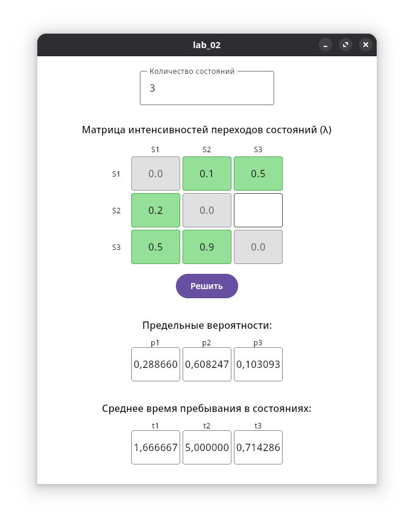

# Лабораторная работа №2
## Задание 
Разработать  программное  обеспечение  для  расчёта  предельных 
вероятностей, среднего  времени  пребывания  в  состояниях. Необходимо 
реализовать для расчета сложной системы S, с количеством состояний [2, 10]. 
Пользователь  должен  иметь  возможность  осуществить ввод матрицы 
интенсивностей переходов состояний  (валидация необходима).  Необходимо 
определить  время  нахождения  системы  в  каждом  состоянии  при 
установившемся режиме работы.  Результаты расчетов  должны  выводится 
пользователю в табличном виде.

