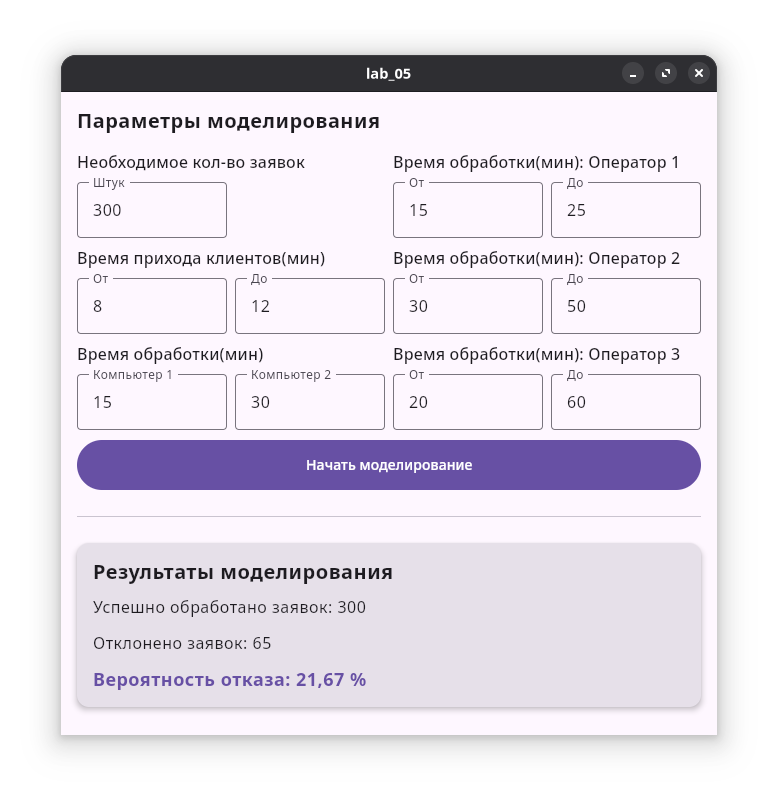

# Лабораторная работа №5
## Задание 
Разработать  программное  обеспечение  для  моделирования  работы 
системы  массового  обслуживания. В информационный  центр  приходят 
клиенты через интервалы времени 10±2 минуты; если все три имеющихся 
оператора заняты, клиенту отказывают в обслуживании.  

Операторы имеют разную производительность и могут обеспечивать 
обслуживание запроса пользователя за 20±5, 40±10, 40±20 минут.  Клиенты 
стремятся  занять  свободного  оператора  с  максимальной 
производительностью. Полученные  запросы  попадают  в  приемный 
накопитель, откуда они выбираются на обработку. 

На первый компьютер поступают запросы от 1-ого и 2-ого операторов, 
на  второй  – от  3-его;  время  обработки  запросов  на  первом  и  втором 
компьютерах  равно,  соответственно,  15  и  30  минутам. За  единицу 
имитационного времени принять 0.01 минуты. 

Промоделировать  процесс  обработки  300  запросов.  Определить 
вероятность отказа. Построить структурную схему модели, а также схему 
модели в терминах систем массового обслуживания.

