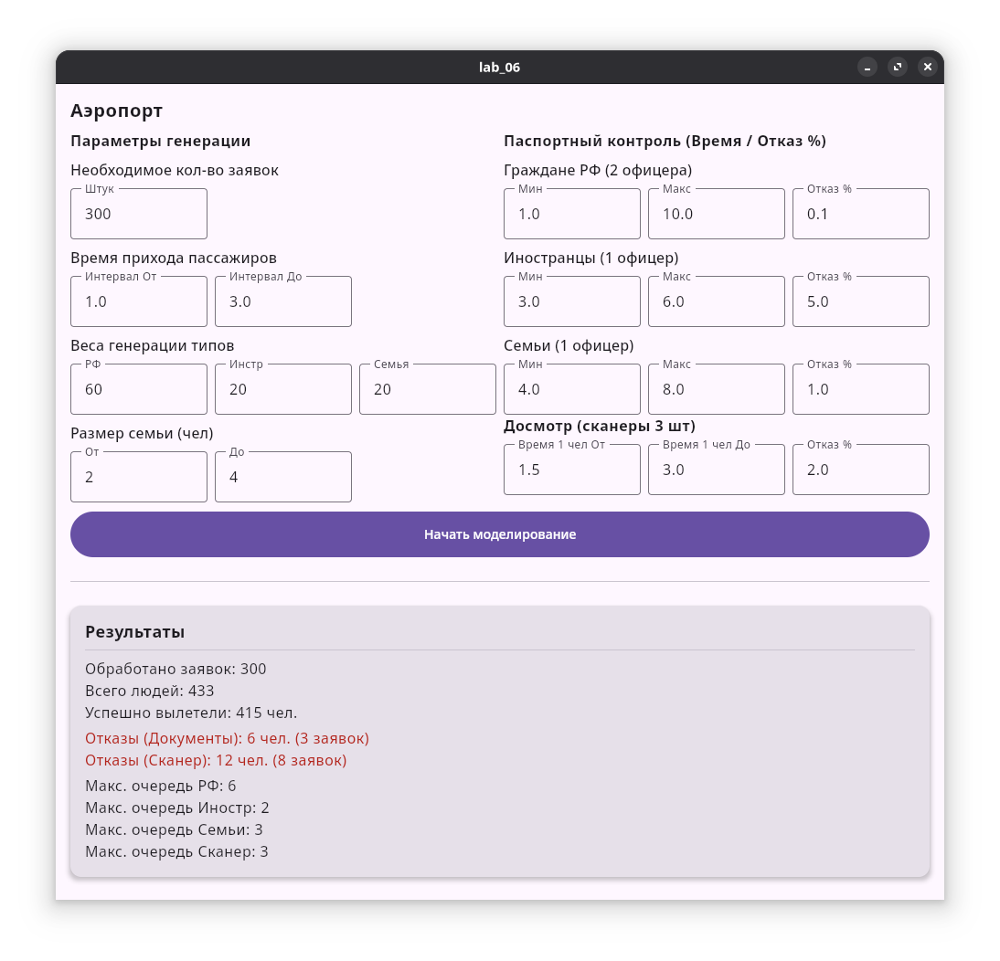

# Лабораторная работа №6
## Задание 
Разработать  программное  обеспечение  для  моделирования  работы 
системы массового обслуживания зоны досмотра аэропорта. 

В  зону  досмотра  прибывают  пассажиры.  Интервал  времени  между 
приходами заявок задается равномерным распределением.  При генерации 
заявки определяется её тип, который задается равномерным распределением 
по весам: 
- Граждане РФ; 
- Иностранные граждане; 
- Семьи с детьми. 

### Фаза 1: Паспортный контроль
Пассажиры распределяются в три независимые очереди в зависимости 
от типа заявки: 
- Очередь 1 (Граждане РФ) обслуживается 2-мя офицерами; 
- Очередь 2 (Иностранцы) обслуживается 1-им офицером; 
- Очередь 3 (Семьи) обслуживается 1-им офицером. 

Время  обслуживания  распределено  равномерно,  но  имеет  разные 
диапазоны для каждой категории. Для семей время обслуживания задается на 
всю группу сразу. 

Возможен отказ в обслуживании (проблемы с документами) с заданной 
вероятностью. Если отказ получает семья, то вся группа покидает систему. 

### Фаза 2: Досмотр
Пассажиры, успешно прошедшие паспортный контроль, попадают в 
общую  очередь перед  зоной  досмотра. Работают  3  сканера.  Время 
сканирования рассчитывается индивидуально для каждого человека(задается 
равномерным распределением). Для групповой заявки (семьи) время занятия 
сканера равно сумме времен сканирования всех членов группы. 

Возможен  отказ  (обнаружение  запрещенных  предметов)  с  заданной 
вероятностью. В случае обнаружения предмета у одного члена семьи, отказ 
получает вся группа. 

