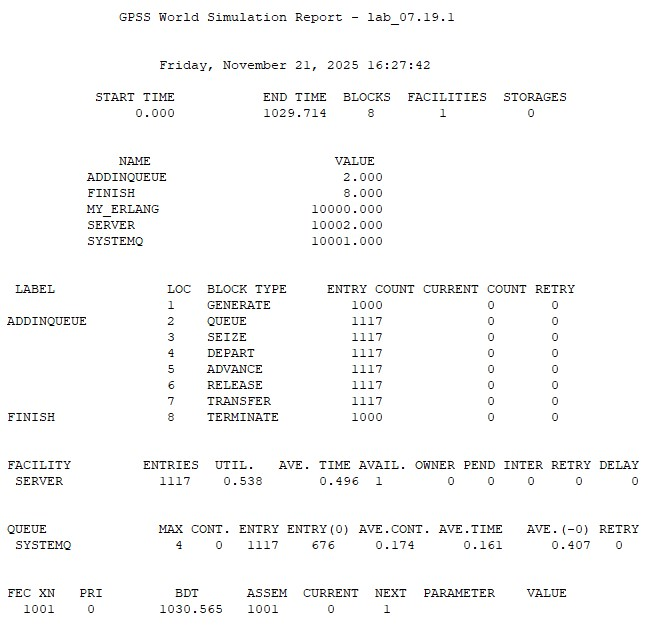

# Лабораторная работа №7
## Задание 
Разработать  программное  обеспечение  для  моделирования  работы 
системы  массового  обслуживания.  Программа  должна  определять 
минимальную длину очереди, при которой не происходит потеря сообщений. 
Закон генерации сообщений задается пользователем.  Закон обслуживания 
сообщений задается пользователем. 

Предусмотреть  возможность  возврата  определенного  процента 
обслуженных заявок обратно в очередь для повторной обработки. Реализовать 
моделирование двумя способами: событийный принцип, пошаговый принцип.

